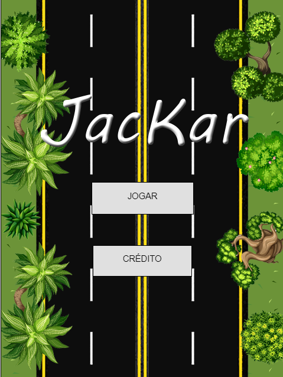
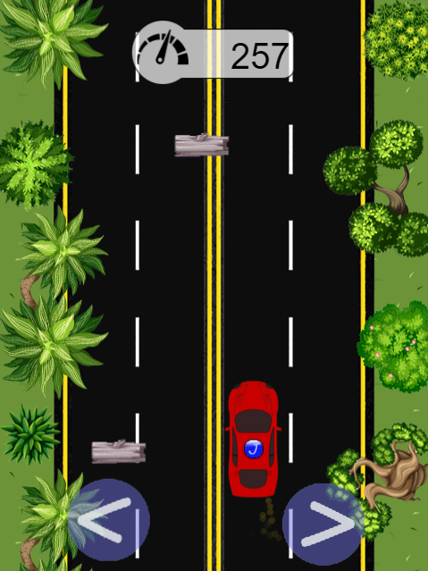

# JacKar-Android :car:

 Jogo de corrida de carro desenvolvido no Construct 3 para plataforma mobile, neste projeto e linkado uma webview dentro da estrutura Android para publicação para Google Play.
 
 O fonte do jogo, feito em JavaScript, encontra-se em github privado, sendo público apenas a parte da integração com o Google Play e o código do Android para vinculação do jogo via WebView.

## Sobre Desenvolvedor :boy:

Jackson Roberio S. dos Santos 

[@Github](https://github.com/jackson-roberio)

[@Linkedin](https://www.linkedin.com/in/jackson-roberio/)

[@StackOverFlow](https://pt.stackoverflow.com/users/161243/jackson-roberio)

## Versões :pencil:

Adotei o [SemVer](https://semver.org/) para versionamento do jogo. Para avaliar as versões, veja [releases do meu repositório](https://github.com/jackson-roberio/JacKar/releases) (obs. alguns versões podem não exercutar corretamente, devido a depreciação de alguns componentes da própria IDE).

> Historicos das versões web :round_pushpin:

* 1.0.0
    * Versão inicial do projeto, contava com três telas diferentes (principal, sobre e jogo) e com mixagem de áudio.
* 2.0.0
    * MUDANÇA: organização das pastas, iniciado o projeto no git.
    * ADD: bônus da melhorar do volante, trazendo um melhor domínio das curvas do carro no jogo.
* 2.1.0
    * MUDANÇA: corrigido bug da pista, agora ela está uniforme;
	* MUDANÇA: alterado a cor da fumaça do carro;
	* MUDANÇA: organização da pasta Sprite, retirado alguns sprites e arquivos desnecessários.

> Historicos das versões Google Play :round_pushpin:

* 1.0.0
    * Versão inicial do projeto baseada na versão 2.1.0, contava com uma única WebView a qual foi negada a publicação pela Google Play por este motivo.


## Publicações (ClickPlay) :video_game:

[Scirra Arcade](https://www.construct.net/en/free-online-games/jackar-12874/play)

[Public Web](https://jacksonroberio.com.br/jackar/)

**_Obs. algunas publicações podem está com uma versão desatualizada do jogo_**


## Telas :performing_arts:

```
   Tela Principal (primeira tela)
```



```
   Tela Game Player (fase única)
```




## Créditos :checkered_flag:

``` Design ```

* [Flaticon](https://www.flaticon.com)

``` Áudio ```

* [Freesound](https://freesound.org)

``` Colaboradores ```

**Desenvolvedores, peço que enviem as modificações com o readme atualizado, com as suas informações e os créditos que precisarei colocar no app que será publicado na google play.** 

